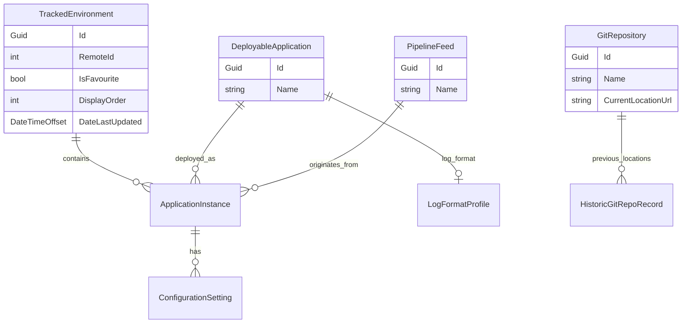

# Digital Services Dev Dash — Backlog

Ordered list of **open** tickets across all epics. When a ticket is completed, add it to **Recently completed** and remove it from **Active**. That section shows **only the latest** completed ticket — replace the row when a new one lands (previous rows drop off). If you complete **multiple tickets in one batch** (same session/commit), list every ticket from that batch in the table instead.

**Source epics:** [tickets/README.md](tickets/README.md)

**Workflow:** [`E:\Goldstein\agent-methodology\instructions.md`](../../agent-methodology/instructions.md)

## Recently completed

| TicketId | Epic | Description |
|----------|------|-------------|
| ~~COV-003~~ | [COV](tickets/COV-coverlet-viewer.md) | Coverage **results table** |

## Active (recommended order)

| TicketId | Epic | Description |
|----------|------|-------------|
| COV-004 | [COV](tickets/COV-coverlet-viewer.md) | **Column-header** filters |
| COV-005 | [COV](tickets/COV-coverlet-viewer.md) | Row **selection**, batch **Hide**, **Show hidden** |
| PIP-004 | [PIP](tickets/PIP-pipeline-feeds.md) | **Pipeline feeds** derived from deployments and build branch |
| THM-001 | [THM](tickets/THM-theme.md) | **Global colour scheme** — non-blue buttons, landing page |
| PKG-003 | [PKG](tickets/PKG-packages.md) | Resolve package by **build number** |

## Epic progress

In-progress epics only. **100%** completed epics move to [Completed epics](#completed-epics-100).

| Epic | Description | Tickets Completed | Tickets Shelved | Total Tickets | Progress |
|------|-------------|-------------------|-----------------|---------------|----------|
| [Coverlet Viewer (COV)](tickets/COV-coverlet-viewer.md) | Coverlet JSON coverage upload and table | 3 | 0 | 5 | 🟩🟩🟩🟩🟩🟩⬜⬜⬜⬜ 60% |
| [Theme (THM)](tickets/THM-theme.md) | Global colour scheme | 0 | 0 | 1 | ⬜⬜⬜⬜⬜⬜⬜⬜⬜⬜ 0% |
| [Packages (PKG)](tickets/PKG-packages.md) | DLL inspection and comparison | 4 | 0 | 5 | 🟩🟩🟩🟩🟩🟩🟩🟩⬜⬜ 80% |
| [Configuration (CFG)](tickets/CFG-configuration.md) | Read and compare shared settings | 9 | 2 | 11 | 🟩🟩🟩🟩🟩🟩🟩🟩🟩⬜⬜ 82% |
| [Pipeline Feeds (PIP)](tickets/PIP-pipeline-feeds.md) | Named pipeline feeds | 2 | 1 | 4 | 🟩🟩🟩🟩🟩⬜⬜⬜⬜⬜ 50% |

*Progress bar: 10 squares — 🟩 completed, 🟨 shelved, ⬜ open; percentage = completed only.*

## Shelved

| TicketId | Epic | Description | Notes |
|----------|------|-------------|-------|
| PIP-002 | [PIP](tickets/PIP-pipeline-feeds.md) | Resolve feed from branch name on ApplicationInstance | Shelved — branch rules enforced elsewhere; no pattern matching in DevDash yet |
| CFG-004 | [CFG](tickets/CFG-configuration.md) | Compare setting by name across apps in one environment | Shelved — superseded by CFG-009 (full app-to-app compare) |
| CFG-005 | [CFG](tickets/CFG-configuration.md) | Compare setting by name for one app across environments | Shelved — superseded by CFG-008 (full instance-to-instance compare) |

## Cancelled

| TicketId | Epic | Description | Notes |
|----------|------|-------------|-------|
| *(none)* | | | |

## Ideas

Unprioritized — not in the active queue. See [IDE-ideas.md](tickets/IDE-ideas.md).

| TicketId | Epic | Description |
|----------|------|-------------|
| *(add ideas as you think of them)* | [IDE](tickets/IDE-ideas.md) | |

---

## Completed epics (100%)

| Epic | Description | Completed |
|------|-------------|-----------|
| [Log Interpreter (LOG)](tickets/LOG-log-interpreter.md) | Adaptable log viewer | LOG-001 – LOG-016 |
| [Environments (ENV)](tickets/ENV-environments.md) | Remote API + environment details hub | ENV-001 – ENV-020 |
| [Foundation (FND)](tickets/FND-foundation.md) | Blazor skeleton and layout | FND-001 – FND-002 |
| [Git History (GTH)](tickets/GTH-git-history.md) | Azure DevOps repository migration history | GTH-001 |
| [Applications (APP)](tickets/APP-applications.md) | Deployable app vs instance | APP-001 – APP-007 |

*LOG, ENV, GTH, and APP epics complete — see [Completed epics](#completed-epics-100).*

## Domain model (overview)

| Epic | Core entities |
|------|---------------|
| ENV | `TrackedEnvironment` (+ remote `RemoteEnvironmentDetails`) |
| APP | `DeployableApplication`, `ApplicationInstance` |
| PIP | `PipelineFeed` |
| PKG | `ApplicationInstance` (package scan target) |
| CFG | `ConfigurationSetting` |
| LOG | `LogFormatProfile` |
| GTH | `GitRepository`, `HistoricGitRepoRecord` |
| COV | — (in-memory session; no SQLite entities) |
| THM | — (presentation layer) |
