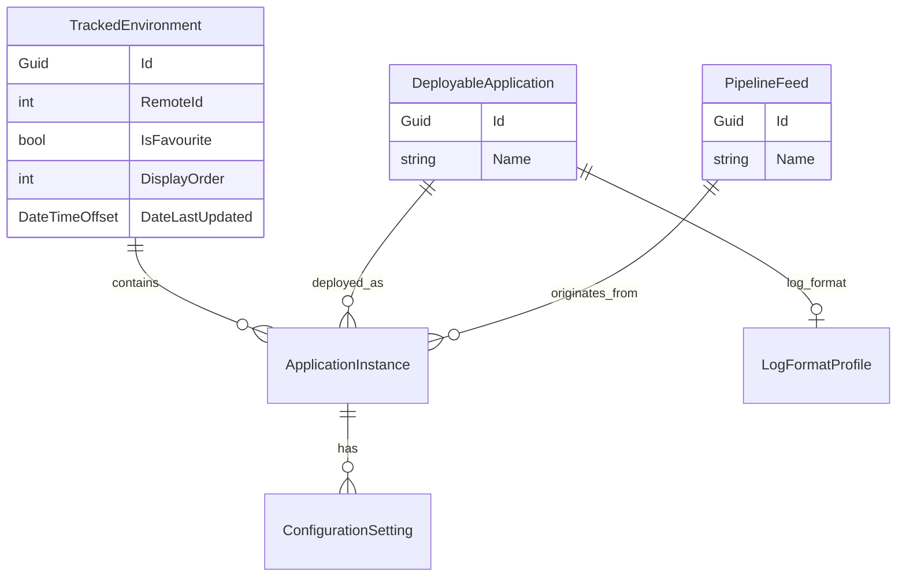

# Digital Services Dev Dash — Backlog

Ordered list of **open** tickets across all epics. When a ticket is completed, add it to **Recently completed** and remove it from **Active**. That section shows **only the latest** completed ticket — replace the row when a new one lands (previous rows drop off). If you complete **multiple tickets in one batch** (same session/commit), list every ticket from that batch in the table instead.

**Source epics:** [tickets/README.md](tickets/README.md)

**Workflow:** [`E:\Goldstein\agent-methodology\instructions.md`](../../agent-methodology/instructions.md)

## Recently completed

| TicketId | Epic | Description |
|----------|------|-------------|
| ~~ENV-020~~ | [ENV](tickets/ENV-environments.md) | **Environment picker** — favourites, code, display order |

## Active (recommended order)

| TicketId | Epic | Description |
|----------|------|-------------|
| PKG-001 | [PKG](tickets/PKG-packages.md) | **Packages** first-class domain (nav and routes) |
| PKG-002 | [PKG](tickets/PKG-packages.md) | Consume deployment **manifest** file |
| PKG-003 | [PKG](tickets/PKG-packages.md) | Resolve package by **build number** |
| PKG-004 | [PKG](tickets/PKG-packages.md) | **Compare DLLs** — two instances of same app |
| PKG-005 | [PKG](tickets/PKG-packages.md) | **Compare DLLs** — two apps in same environment |
| APP-006 | [APP](tickets/APP-applications.md) | **Wire Source Branch** on deployed applications |
| APP-007 | [APP](tickets/APP-applications.md) | **Wire Homepage URL** on deployed applications |
| CFG-006 | [CFG](tickets/CFG-configuration.md) | Rename to **Configuration Viewer** |
| CFG-007 | [CFG](tickets/CFG-configuration.md) | Import **web.config**, **app.config**, **exe.config** |
| PIP-004 | [PIP](tickets/PIP-pipeline-feeds.md) | **Pipeline feeds** derived from deployments and build branch |
| THM-001 | [THM](tickets/THM-theme.md) | **Global colour scheme** — non-blue buttons, landing page |

## Epic progress

In-progress epics only. **100%** completed epics move to [Completed epics](#completed-epics-100).

| Epic | Description | Tickets Completed | Tickets Shelved | Total Tickets | Progress |
|------|-------------|-------------------|-----------------|---------------|----------|
| [Theme (THM)](tickets/THM-theme.md) | Global colour scheme | 0 | 0 | 1 | ⬜⬜⬜⬜⬜⬜⬜⬜⬜⬜ 0% |
| [Applications (APP)](tickets/APP-applications.md) | Deployable app vs instance | 5 | 0 | 7 | 🟩🟩🟩🟩🟩🟩🟩⬜⬜⬜ 71% |
| [Packages (PKG)](tickets/PKG-packages.md) | DLL inspection and comparison | 0 | 0 | 5 | ⬜⬜⬜⬜⬜⬜⬜⬜⬜⬜ 0% |
| [Configuration (CFG)](tickets/CFG-configuration.md) | Read and compare shared settings | 3 | 2 | 7 | 🟩🟩🟩🟩🟩⬜⬜⬜⬜⬜ 43% |
| [Pipeline Feeds (PIP)](tickets/PIP-pipeline-feeds.md) | Named pipeline feeds | 2 | 1 | 4 | 🟩🟩🟩🟩🟩⬜⬜⬜⬜⬜ 50% |

*Progress bar: 10 squares — 🟩 completed, 🟨 shelved, ⬜ open; percentage = completed only.*

## Shelved

| TicketId | Epic | Description | Notes |
|----------|------|-------------|-------|
| PIP-002 | [PIP](tickets/PIP-pipeline-feeds.md) | Resolve feed from branch name on ApplicationInstance | Shelved — branch rules enforced elsewhere; no pattern matching in DevDash yet |
| CFG-004 | [CFG](tickets/CFG-configuration.md) | Compare setting by name across apps in one environment | Shelved — compare views deprioritized; per-instance browse (CFG-003) sufficient for now |
| CFG-005 | [CFG](tickets/CFG-configuration.md) | Compare setting by name for one app across environments | Shelved — compare views deprioritized; per-instance browse (CFG-003) sufficient for now |

## Cancelled

| TicketId | Epic | Description | Notes |
|----------|------|-------------|-------|
| *(none)* | | | |

## Ideas

Unprioritized — not in the active queue. See [IDE-ideas.md](tickets/IDE-ideas.md).

| TicketId | Epic | Description |
|----------|------|-------------|
| *(add ideas as you think of them)* | [IDE](tickets/IDE-ideas.md) | |

---

## Completed epics (100%)

| Epic | Description | Completed |
|------|-------------|-----------|
| [Log Interpreter (LOG)](tickets/LOG-log-interpreter.md) | Adaptable log viewer | LOG-001 – LOG-016 |
| [Environments (ENV)](tickets/ENV-environments.md) | Remote API + environment details hub | ENV-001 – ENV-020 |
| [Foundation (FND)](tickets/FND-foundation.md) | Blazor skeleton and layout | FND-001 – FND-002 |

*APP epic reopened — see [Epic progress](#epic-progress). LOG and ENV epics complete — see [Completed epics](#completed-epics-100).*

## Domain model (overview)

| Epic | Core entities |
|------|---------------|
| ENV | `TrackedEnvironment` (+ remote `RemoteEnvironmentDetails`) |
| APP | `DeployableApplication`, `ApplicationInstance` |
| PIP | `PipelineFeed` |
| PKG | `ApplicationInstance` (package scan target) |
| CFG | `ConfigurationSetting` |
| LOG | `LogFormatProfile` |
| THM | — (presentation layer) |
