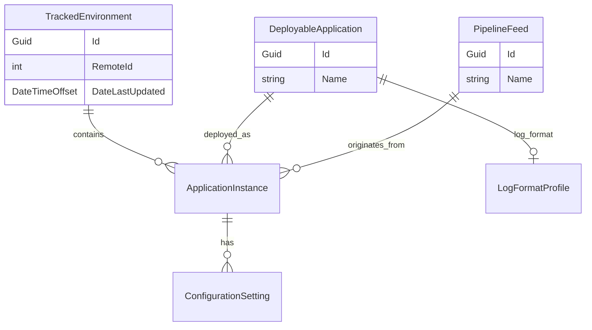

# Digital Services Dev Dash — Backlog

Ordered list of **open** tickets across all epics. When a ticket is completed, add it to **Recently completed** and remove it from **Active**. That section shows **only the latest** completed ticket — replace the row when a new one lands (previous rows drop off). If you complete **multiple tickets in one batch** (same session/commit), list every ticket from that batch in the table instead.

**Source epics:** [tickets/README.md](tickets/README.md)

**Workflow:** [`E:\Goldstein\agent-methodology\instructions.md`](../../agent-methodology/instructions.md)

## Recently completed

| TicketId | Epic | Description |
|----------|------|-------------|
| ~~ENV-004~~ | [ENV](tickets/ENV-environments.md) | Environment details page (SQL copy, BuildNumber/TFS, WIP branch) |

## Active (recommended order)

| TicketId | Epic | Description |
|----------|------|-------------|
| ENV-005 | [ENV](tickets/ENV-environments.md) | Deployed applications table on environment details |
| ENV-006 | [ENV](tickets/ENV-environments.md) | Deployed application packages page (DLL list + versions) |
| APP-004 | [APP](tickets/APP-applications.md) | ApplicationInstance admin UI |
| LOG-001 | [LOG](tickets/LOG-log-interpreter.md) | LogFormatProfile per DeployableApplication |
| CFG-001 | [CFG](tickets/CFG-configuration.md) | Configuration setting model and storage |
| CFG-002 | [CFG](tickets/CFG-configuration.md) | Import settings from deployed application locations |
| LOG-002 | [LOG](tickets/LOG-log-interpreter.md) | Log file reader using ApplicationInstance paths |
| CFG-003 | [CFG](tickets/CFG-configuration.md) | Settings browser UI (view all settings for an instance) |
| CFG-004 | [CFG](tickets/CFG-configuration.md) | Compare setting by name across apps in one environment |
| CFG-005 | [CFG](tickets/CFG-configuration.md) | Compare setting by name for one app across environments |
| LOG-003 | [LOG](tickets/LOG-log-interpreter.md) | Log viewer UI (environment → instance picker) |
| LOG-004 | [LOG](tickets/LOG-log-interpreter.md) | Log filtering (level, text search) |

## Epic progress

In-progress epics only. **100%** completed epics move to [Completed epics](#completed-epics-100).

| Epic | Description | Tickets Completed | Tickets Shelved | Total Tickets | Progress |
|------|-------------|-------------------|-----------------|---------------|----------|
| [Environments (ENV)](tickets/ENV-environments.md) | Remote API + local tracking + environment details hub | 4 | 0 | 6 | 🟩🟩🟩🟩🟩🟩🟩⬜⬜⬜ 67% |
| [Applications (APP)](tickets/APP-applications.md) | Deployable app vs instance | 3 | 0 | 4 | 🟩🟩🟩🟩🟩🟩🟩🟩⬜⬜ 75% |
| [Pipeline Feeds (PIP)](tickets/PIP-pipeline-feeds.md) | Named pipeline feeds (no branch matching v1) | 2 | 1 | 3 | 🟩🟩🟩🟩🟩🟩🟨🟨🟨⬜ 67% |
| [Configuration (CFG)](tickets/CFG-configuration.md) | Read and compare shared settings | 0 | 0 | 5 | ⬜⬜⬜⬜⬜⬜⬜⬜⬜⬜ 0% |
| [Log Interpreter (LOG)](tickets/LOG-log-interpreter.md) | Adaptable log viewer | 0 | 0 | 4 | ⬜⬜⬜⬜⬜⬜⬜⬜⬜⬜ 0% |

*Progress bar: 10 squares — 🟩 completed, 🟨 shelved, ⬜ open; percentage = completed only.*

## Shelved

| TicketId | Epic | Description | Notes |
|----------|------|-------------|-------|
| PIP-002 | [PIP](tickets/PIP-pipeline-feeds.md) | Resolve feed from branch name on ApplicationInstance | Shelved — branch rules enforced elsewhere; no pattern matching in DevDash yet |

## Cancelled

| TicketId | Epic | Description | Notes |
|----------|------|-------------|-------|
| *(none)* | | | |

## Ideas

Unprioritized — not in the active queue. See [IDE-ideas.md](tickets/IDE-ideas.md).

| TicketId | Epic | Description |
|----------|------|-------------|
| *(add ideas as you think of them)* | [IDE](tickets/IDE-ideas.md) | |

---

## Completed epics (100%)

| Epic | Description | Completed |
|------|-------------|-----------|
| [Foundation (FND)](tickets/FND-foundation.md) | Blazor skeleton and layout | FND-001 – FND-002 |

## Domain model (overview)

| Epic | Core entities |
|------|---------------|
| ENV | `TrackedEnvironment` (+ remote `RemoteEnvironmentDetails`) |
| APP | `DeployableApplication`, `ApplicationInstance` |
| PIP | `PipelineFeed` |
| CFG | `ConfigurationSetting` |
| LOG | `LogFormatProfile` |
